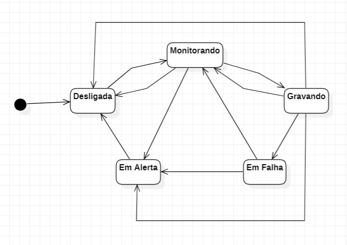
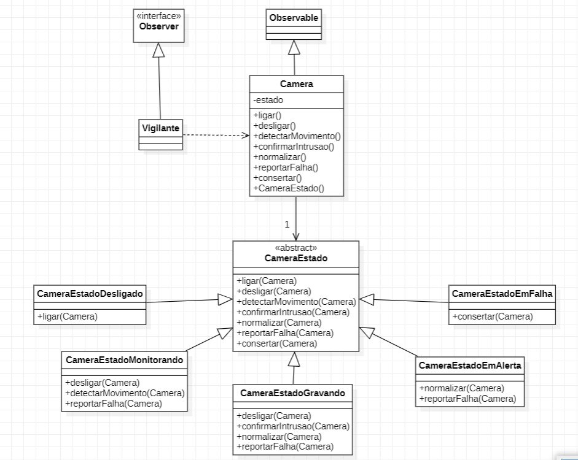

# Desafio Integração dos padrões State e Observer, Sistema de Câmeras

#### Nome: João Vitor Fernandes Ribeiro Carneiro Ramos
#### Matrícula: 202165076C

Implementação dos padrões de projeto **State** e **Observer** em Java.

## Diagramas UML

